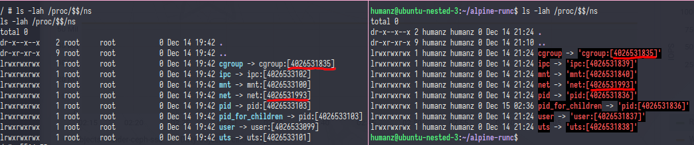
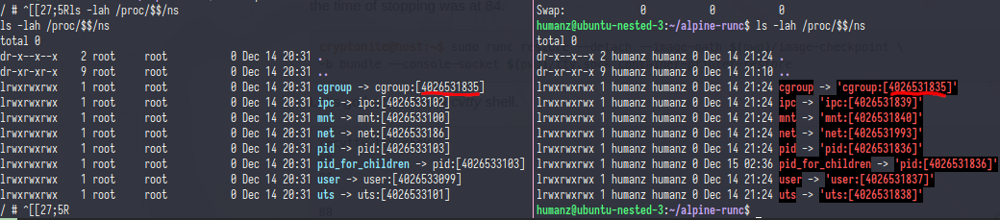
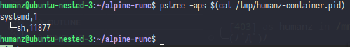
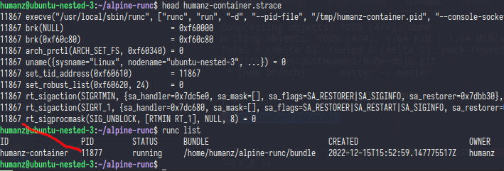
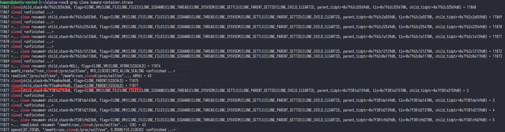
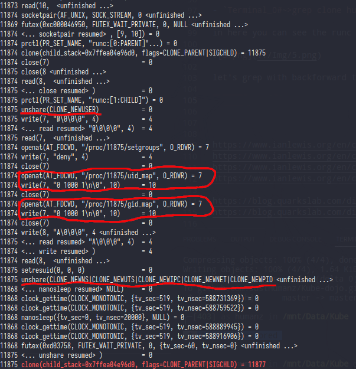
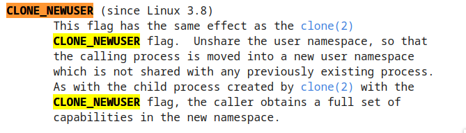

# Runc

# READ & WATCH THIS LIST FIRST
- https://www.ianlewis.org/en/container-runtimes-part-1-introduction-container-r
- https://www.ianlewis.org/en/container-runtimes-part-2-anatomy-low-level-contai
- https://www.ianlewis.org/en/container-runtimes-part-3-high-level-runtimes
- https://www.ianlewis.org/en/container-runtimes-part-4-kubernetes-container-run

- https://blog.quarkslab.com/digging-into-linux-namespaces-part-1.html
- https://blog.quarkslab.com/digging-into-runtimes-runc.html

- https://en.wikipedia.org/wiki/Namespace
- https://man7.org/linux/man-pages/man7/capabilities.7.html
- https://man7.org/linux/man-pages/man2/clone.2.html
- https://man7.org/linux/man-pages/man1/unshare.1.html
- https://youtu.be/-YnMr1lj4Z8

In this step we need multiple terminal,so i will use prefix Terminal<count># to tell you if we need another terminal 

- `Terminal_0#~>runc spec --rootless`
- `Terminal_0#~>nano config.json` #change "readonly" to false
- `Terminal_0#~>wget http://dl-cdn.alpinelinux.org/alpine/v3.10/releases/x86_64/alpine-minirootfs-3.10.1-x86_64.tar.gz; mkdir rootfs && tar -xzf alpine-minirootfs-3.10.1-x86_64.tar.gz -C rootfs`
- `Terminal_0#~>mkdir bundle && mv config.json ./bundle && mv rootfs ./bundle;`
- `Terminal_1#~>recvtty humanz-container.sock`
- `Terminal_0#~>runc run -d  --pid-file /tmp/humanz-container.pid --console-socket $(pwd)/humanz-container.sock -b bundle humanz-container`
- `Terminal_1#~>sh` # In terminal 1 should be spawn a shell
- `Terminal_0#~>ls -lah /proc/$$/ns`
- `Terminal_1#~>ls -lah /proc/$$/ns`
The result should be like this:  

- `Terminal_0#~>ifconfig`
- `Terminal_1#~>ifconfig`

- `Terminal_0#~>free -m`
- `Terminal_1#~>free -m`

As you can see,the cgroup,net have same ID in your container & your host machine

Now let try to isolate the network namespaces

- `Terminal_0#~>nano config.json` #find "namespaces" key and add {"type":"network"} at end of namespaces key
- `Terminal_1#~>recvtty humanz-container.sock`
- `Terminal_0#~>runc run -d --pid-file /tmp/humanz-container.pid --console-socket $(pwd)/humanz-container.sock -b bundle humanz-container`

- `Terminal_0#~>ifconfig`
- `Terminal_1#~>ifconfig`

- `Terminal_0#~>sudo ip link add veth0 type veth peer name alp0`
- `Terminal_0#~>sudo ip add add 10.0.0.10/24 dev veth0`
- `Terminal_0#~>sudo ip link set veth0 up`
- `Terminal_0#~>sudo ip link set alp0 netns /proc/$(cat /tmp/humanz-container.pid)/ns/net`
- `Terminal_0#~>sudo nsenter --target $(cat /tmp/humanz-container.pid) --net`
- `Terminal_0#~>ip add add 10.0.0.20/24 dev alp0`
- `Terminal_0#~>ip link set alp0 up`
- `Terminal_0#~>exit`
- `Terminal_1#~>ifconfig`
- `Terminal_0#~>ping 10.0.0.20`
- `Terminal_1#~>ping 10.0.0.10` # you should get error "ping: permission denied (are you root?)"
- `Terminal_1#~>id`

- `Terminal_0#~>nano config.json` #find "capabilities" key and you will find the bounding,effective,etc add `CAP_NET_RAW` in earch key member
- `Terminal_1#~>recvtty humanz-container.sock`
- `Terminal_0#~>runc run -d  --pid-file /tmp/humanz-container.pid --console-socket $(pwd)/humanz-container.sock -b bundle humanz-container`

- `Terminal_0#~>sudo ip link add veth0 type veth peer name alp0`
- `Terminal_0#~>sudo ip add add 10.0.0.10/24 dev veth0`
- `Terminal_0#~>sudo ip link set veth0 up`
- `Terminal_0#~>sudo ip link set alp0 netns /proc/$(cat /tmp/humanz-container.pid)/ns/net`
- `Terminal_0#~>sudo nsenter --target $(cat /tmp/humanz-container.pid) --net`
- `Terminal_0#~>ip add add 10.0.0.20/24 dev alp0`
- `Terminal_0#~>ip link set alp0 up`
- `Terminal_0#~>exit`
- `Terminal_1#~>ifconfig`
- `Terminal_0#~>ping 10.0.0.20`
- `Terminal_1#~>ping 10.0.0.10`

### Note
Config the network after the container running was not best practice,for the best practice is setup the network first after that start the container,you can do that by
- `Terminal_0#~>runc create -b bundle --pid-file /tmp/humanz-container.pid --console-socket $(pwd)/humanz-container.sock humanz-container`
- `Terminal_0#~>sudo ip link add veth0 type veth peer name alp0`
- `Terminal_0#~>sudo ip add add 10.0.0.10/24 dev veth0`
- `Terminal_0#~>sudo ip link set veth0 up`
- `Terminal_0#~>sudo ip link set alp0 netns /proc/$(cat /tmp/humanz-container.pid)/ns/net`
- `Terminal_0#~>sudo nsenter --target $(cat /tmp/humanz-container.pid) --net`
- `Terminal_0#~>ip add add 10.0.0.20/24 dev alp0`
- `Terminal_0#~>ip link set alp0 up`
- `Terminal_1#~>recvtty humanz-container.sock`
- `Terminal_0#~>runc start humanz-container`

If you want to run container as root (not rootless) you can run `runc spec --root` and do the rest with sudo

## Root is Root,but not Root
- `Terminal_1#~>recvtty humanz-container.sock`
- `Terminal_0#~>strace -f -o humanz-container.strace runc run -d  --pid-file /tmp/humanz-container.pid --console-socket $(pwd)/humanz-container.sock -b bundle humanz-container`
- `Terminal_0#~>pstree -aps $(cat /tmp/humanz-container.pid)` 
the output should be system 1 then sh <container pid>  

**Prepare your magic hat,because we want do some magic in here.**

- `Terminal_0#~>head humanz-container.strace`
- `Terminal_0#~>runc list`

if you relize it the container pid was not same with the strace log,that because the runc **only spawning and running containers** not manage it like docker or other high level container software so after the container spawning the runc will leave the container and because of that the container pid was child of pid 1 

- `Terminal_0#~>grep clone humanz-container.strace`

in here you can see the runc will create multiple child process to build container,the most interisiting is in runc create clone for container pid 

let's grep with back forward to see what happen process before runc start the container

ladies and gentlemen here i present to you,the magic behind container technology

1. the runc run `unshare` with `CLONE_NEWUSER`,remember if we run this container was rootless mode right? but in container we still get the root even we run the container not as root. as per manual say the `CLONE_NEWUSER` have fuction to **Unshare the user namespace, so that the calling process is moved into a new user namespace which is not shared with any previously existing process**

And don't forget about uid_map&gid_map,container just got unshared the user namespaces so for now in that container the user should be nobody(the default) but the runc trics it with set the uid_map&gid_map

For the last unshare you can focust on CLONE_NEWPID

